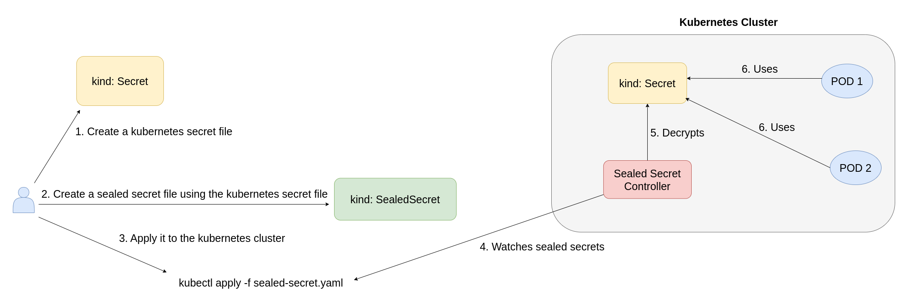

# Sealed Secrets in Kubernetes

* Storing sensitive data like secret objects of Kubernetes in a Github repository is not safe and also not recommended. Because raw Kubernetes secrets, which are base64-encoded, are easily decodable.

* Sealed Secrets is an open-source project [[1]](https://github.com/bitnami-labs/sealed-secrets) started at Bitnami and is used to encrypt Kubernetes secrets. Once encrypted, you can store this encrypted secret in your Git repository safely. It allows DevOps practices without exposing sensitive data.

  Only the Sealed Secrets controller can decrypt these encrypted secrets.


### How do Sealed Secrets work?

By following these steps, users can ensure the secure management and deployment of their Kubernetes secrets.

* Encryption: The user encrypts Kubernetes secrets using a Sealed Secrets controller.
* Storage: The Sealed Secrets are safely stored in Git.
* Deployment: The user deploys the Sealed Secrets to the Kubernetes cluster.
* Decryption and Creation: The Sealed Secrets controller decrypts the sealed secrets and creates Kubernetes secret resources on the cluster.


### Sealed Secrets Workflow



The Sealed Secrets controller in the Sealed Secrets ecosystem is responsible for watching for Sealed Secret custom resources. When it detects one, it decrypts the enclosed secret using its private key and then creates a standard Kubernetes Secret. Its significance lies in its ability to manage and decrypt Sealed Secrets securely, ensuring that only the cluster with the corresponding private key can access the original secret content.

### Installation

1. Prerequisites

   - Kubernetes 1.32+
   - Helm 3.17.2


2. helm repo add sealed-secrets https://bitnami-labs.github.io/sealed-secrets

3. helm install my-release sealed-secrets/sealed-secrets

4. Install kubeseal CLI

  ```
  # Fetch the latest sealed-secrets version using GitHub API
KUBESEAL_VERSION=$(curl -s https://api.github.com/repos/bitnami-labs/sealed-secrets/tags | jq -r '.[0].name' | cut -c 2-)

# Check if the version was fetched successfully
if [ -z "$KUBESEAL_VERSION" ]; then
    echo "Failed to fetch the latest KUBESEAL_VERSION"
    exit 1
fi

wget "https://github.com/bitnami-labs/sealed-secrets/releases/download/v${KUBESEAL_VERSION}/kubeseal-${KUBESEAL_VERSION}-linux-amd64.tar.gz"
tar -xvzf kubeseal-${KUBESEAL_VERSION}-linux-amd64.tar.gz kubeseal
sudo install -m 755 kubeseal /usr/local/bin/kubeseal
  ```
- Check whether kebuseal cli can talk to the kubernetes cluster:

   - ```kubeseal --fetch-cert --controller-name=my-release-sealed-secrets --controller-namespace=default```

### Test

1. Create a new secret yaml file named dashboard with DASH_PASW=supersecret123
   - ```kubectl create secret generic dashboard --from-literal=DASH_PASW=supersecret123 --dry-run=client -o yaml > secret.yaml```

2. Create a sealed-secret using the secret above:

   - ```kubeseal --controller-name=my-release-sealed-secrets --controller-namespace=default --format yaml < secret.yaml > sealed-secret.yaml```

3. Apply the sealed-secret to the kubernetes cluster

   - ```kubectl apply -f sealed-secret.yaml```

   - When we run kubectl get secret, we can see that a Kubernetes secret object named "dashboard" is created. Because the kubeseal operator automatically decrypts the sealed-secret and creates the kubernetes secret behind the scene.
      - ```kubectl get secret
           NAME                               TYPE                 DATA   AGE
           dashboard                          Opaque               1      66s
        ```

### Resources

1. https://github.com/bitnami-labs/sealed-secrets

2. [Sealed Secrets: Safeguarding Your Kubernetes Secrets | Step By Step Tutorial | KodeKloud](https://www.youtube.com/watch?v=wWMJCY2E0d4)

3. https://artifacthub.io/packages/helm/bitnami-labs/sealed-secrets